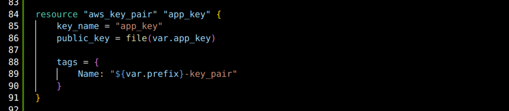
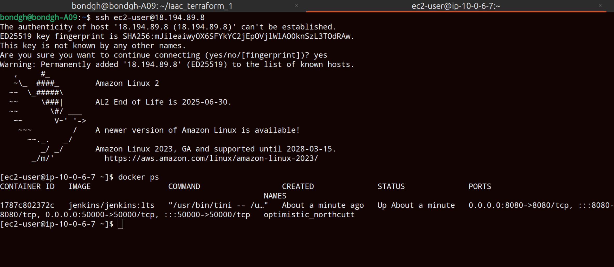

# Iaac_terraform_1

<h1>Automate AWS Infrastructure</h1>
<h2>Technologies used</h2>

- <b>terraform</b> 
- <b>AWS</b>
- <b>Docker</b>
- <b>Linux<b/>
- <b>Git<b/>

<h2>Detailed Description of Project </h2>
1.Create TF project to automate provisioning AWS Infrastructure and its components, such as: VPC,Subnet, Route Table,internet Gateway,securityGroup and EC2 
2. Configure TF script to automate deploying docker container to EC2 instance 

   

   <h2>step 1  Create VPC </h2>
   Create a file in the code editor for providers  
   Create main.tf file in the code editor   
   authenticate with AWS using AWS global credentials  

   create aws resources in the main.tf file  
   Resources created includes: vpc, subnet and internet gateway.
          
   

   The internet gateway is associated with the default route table  
   This configuration allowa connection if vpc to internet 
   

   values are parameterized and listed in the variables.tf file. This makes the configuration file reuseable
   

   the values of the variable are listed in the terraform.tfvars file
   

         terraform init: 
   

        terraform plan:
   

       terraform apply
   

   Vpc, subnet, internet gateway and default route table have been created
   

   

 

   
   
   

 

   <h2>step 2  Creation of Security group and instance</h2>
    Creation of security group: port 22 is configured to allow only my ip address to ssh into the instance  
    port 8080 is opened to allow all traffic from the internet because the application is run on that port 

   

   configuration is made to allow accessing ami id dynamically without hard coding

   

   Key pair associated with the created instance is created using my public key so with the corresponding private key i can ssh into the server

   

    Creation of instance
   

   The script is passed to user data to automatically install docker and run jenkins on port 8080 upon creation of the instance
   

   Able to ssh into the created instance with the public and private key  
   docker was installed and Jenkins container started successfully
   

   Jenkins running on specified port 8080 on the instance
   

    
  

  

  

 
   
   

  
  
   

   

  

   

 
     

